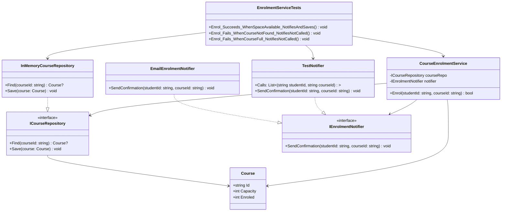

# Course EnrollmentS ervice | Dependency Inversion Princi

## Project summary

This project implements a small class-library solution for course enrollment management. The design follows a clean separation of concerns:

- a course repository abstraction exposes persistence operations,
- a notifier abstraction sends enrollment confirmation messages,
- an enrollment service coordinates validation and updates,
- a test project acts as the executable entry point for verification.

The solution is intentionally lightweight and in-memory, making it suitable for demonstrating dependency inversion, repository patterns, interface-driven design, and unit testing in C#.

## Assignment brief and specification

The required system behaviour is as follows:

1. A course has a unique identifier, a capacity, and a current number of enroled students.
2. A student attempts to enroll in a course.
3. If the course does not exist, enrollment fails.
4. If the course is full, enrollment fails.
5. If enrollment succeeds, the stored course count is incremented and a confirmation notification is sent.
6. The service must use interfaces so that the application depends on abstractions instead of concrete implementations.
7. The project must be implemented as a class library, with a unit-test project acting as the executive environment.

The system therefore has a clear business rule: enrollment is permitted only when the course exists and has space available.


# Class Diagram



## Acknowledgement 

- This project was created as an original implementation for the course assignment
- Offical Microsft Documentation are used including topics such as records, collections, access modifiers such as sealed
- The [Observers pattern demo](https://github.com/chittur/observer-pattern-demo) is used for the reference for testing
- mermaid for UML diagrams [link](https://mermaid.js.org/syntax/classDiagram.html)


## Implementation details

### Project structure

- CourseRepository/ICourseRepository.cs
- CourseRepository/InMemoryCourseRepository.cs
- EnrolmentNotifier/IEnrolmentNotifier.cs
- EnrolmentNotifier/EmailEnrolmentNotifier.cs
- EnrolmentService/EnrolementService.cs
- CourseEnrollmentUnitTests/CourseEnrollmentUnitTests.cs


## Testing 

The test project uses MSTest and validates real behavior through the service and its dependencies. The tests check the observable outcomes without relying on production-only seams or artificial test hooks.

### Test cases

1. Enrol succeeds when capacity is available and notification is sent.
2. Enrol fails when the course is missing and no notification is sent.
3. Enrol fails when the course is full and no notification is sent.

This is a focused and meaningful set of tests because they cover the primary business rules.

## Build and run instructions

This is a class-library project only. The test project acts as the executive and is used to compile and validate the solution.

From the repository root, run:

```bash
dotnet test CourseEnrollmentService.slnx --nologo
```

This command builds all dependent projects and executes the unit tests.

## Verification status

As of the current repository state, the solution builds successfully and all test cases pass:

- Total tests: 3
- Failed: 0
- Passed: 3
